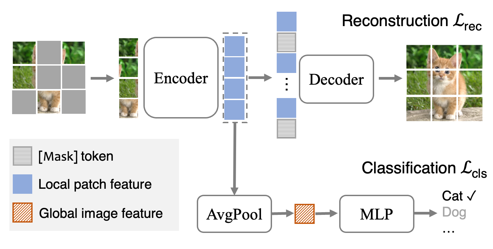
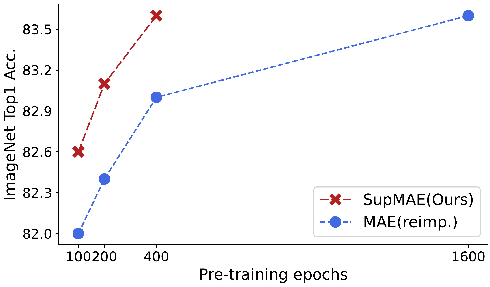

## SupMAE: Supervised Masked Autoencoders Are Efficient Vision Learners




This is a offical PyTorch/GPU implementation of the paper [SupMAE: Supervised Masked Autoencoders Are Efficient Vision Learners](https://arxiv.org/abs/2205.14540).

* This repo is a modification on the [MAE repo](https://github.com/facebookresearch/mae). Installation and preparation follow that repo.

* This repo is based on [`timm==0.3.2`](https://github.com/rwightman/pytorch-image-models), for which a [fix](https://github.com/rwightman/pytorch-image-models/issues/420#issuecomment-776459842) is needed to work with PyTorch 1.8.1+.

### TL;DR

Supervised MAE (SupMAE) is an extension of MAE by adding a supervised classification branch. SupMAE is efficient and can achieve comparable performance with MAE using only 30% compute. SupMAE’s robustness on ImageNet variants and transfer learning performance outperforms MAE and standard supervised pre-training counterparts. 

#### :one: SupMAE is more training efficient




#### :two: SupMAE model is more robust

| dataset        | MAE  | DeiT | SupMAE(Ours) |
|----------------|------|------|--------------|
| IN-Corruption ↓ | 51.7 | 47.4 | 48.1         |
| IN-Adversarial | 35.9 | 27.9 | 35.5         |
| IN-Rendition   | 48.3 | 45.3 | 51.0         |
| IN-Sketch      | 34.5 | 32.0 | 36.0         |
| Score          | 41.8 | 39.5 | 43.6         |

Note: The score is measured by the averaging metric across four variants (we use ’100 - error’ for the IN-Corruption performance metric).

#### :three: SupMAE learns more transferable features

##### Few-shot learning on 20 classification datasets


|              | Checkpoint   | Method    | 5-shot       | 20-shot      | 50-shot      |
|--------------|--------------|-----------|--------------|--------------|--------------|
| Linear Probe | MAE          | Self-Sup. | 33.37 ± 1.98 | 48.03 ± 2.70 | 58.26 ± 0.84 |
| Linear Probe | MoCo-v3      | Self-Sup. | 50.17 ± 3.43 | 61.99 ± 2.51 | 69.71 ± 1.03 |
| Linear Probe | SupMAE(Ours) | Sup.      | 47.97 ± 0.44 | 60.86 ± 0.31 | 66.68 ± 0.47 |
| Fine-tune    | MAE          | Self-Sup. | 36.10 ± 3.25 | 54.13 ± 3.86 | 65.86 ± 2.42 |
| Fine-tune    | MoCo-v3      | Self-Sup. | 39.30 ± 3.84 | 58.75 ± 5.55 | 70.33 ± 1.64 |
| Fine-tune    | SupMAE(Ours) | Sup.      | 46.76 ± 0.12 | 64.61 ± 0.82 | 71.71 ± 0.66 |

Note: We are using the [Elevater_Toolkit_IC](https://github.com/Computer-Vision-in-the-Wild/Elevater_Toolkit_IC) (HIGHLY recommendation)!


##### Semantic segmentation with ADE-20k


| method           | mIoU | aAcc | mAcc |
|------------------|------|------|------|
| Naive supervised | 47.4 | -    | -    |
| MAE              | 48.6 | 82.8 | 59.4 |
| SupMAE (ours)    | 49.0 | 82.7 | 60.2 |

Note: We are using [mmsegmentaion](https://github.com/open-mmlab/mmsegmentation/tree/master/configs/mae)

### Abstract

Recently, self-supervised Masked Autoencoders (MAE) have attracted unprecedented attention for their impressive representation learning ability. However, the pretext task, Masked Image Modeling (MIM), reconstructs the missing local patches, lacking the global understanding of the image. This paper extends MAE to a fully-supervised setting by adding a supervised classification branch, thereby enabling MAE to effectively learn global features from golden labels. The proposed Supervised MAE (SupMAE) only exploits a visible subset of image patches for classification, unlike the standard supervised pre-training where all image patches are used. Through experiments, we demonstrate that not only is SupMAE more training efficient but also it learns more robust and transferable features.

### Catalog

- [x] Pre-training code
- [x] Fine-tuning code
- [x] Pre-trained checkpoints & logs

### Pre-trained checkpoints & logs

Due to computation constraint, we ONLY test the ViT-B/16 model. 

|            | Pre-training | Fine-tuning |
|------------|:------------:|:-----------:|
| checkpoint |     [ckpt](https://drive.google.com/file/d/1YwcTJvASZJvn2LxyZZG4PcgXaBCKEv_4/view?usp=sharing) <br /> md5: <tt>d83c8a</tt>  |     [ckpt](https://drive.google.com/file/d/1G-7lEJKDItXxQ3aytpwWC8WBAFwzKryO/view?usp=sharing) <br /> md5: <tt>1fb748</tt>    |
| logs       |      [log](./misc/pretrain_log.txt)     |     [log](./misc/finetune_log.txt)     |


### Pre-training

The pre-training instruction is in [PRETRAIN.md](PRETRAIN.md).

### Fine-tuning 

The fine-tuning instruction is in [FINETUNE.md](FINETUNE.md).

### Citation
If you find this repository helpful, please consider citing our work
```
@article{liang2022supmae,
  title={SupMAE: Supervised Masked Autoencoders Are Efficient Vision Learners},
  author={Liang, Feng and Li, Yangguang and Marculescu, Diana},
  journal={arXiv preprint arXiv:2205.14540},
  year={2022}
}
```


### License

This project is under the CC-BY-NC 4.0 license. See [LICENSE](LICENSE) for details.
